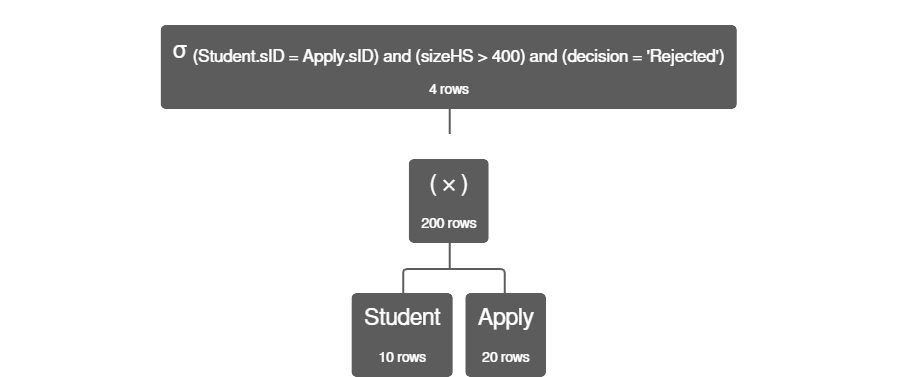

# Relational algebra

- College(cName,state,enrollment) cName
- Student(sID,sName,GPA,sizeHS) sID
- Apply(sID,cName,major,decision) (sID,cName,major)

<https://dbis-uibk.github.io/relax/calc/local/uibk/local/0>

<https://jordanbell.info/relax/calc/local/uibk/local/0>

```
group: collegeAdmissions 

College = {
cName, state, enr
'University of California, Los Angeles', 'CA', 45000
'University of Texas at Austin', 'TX', 51000
'Harvard University', 'MA', 31000
'University of Michigan', 'MI', 46000
'New York University', 'NY', 55000
}

Student = {
sID:number, sName:string, GPA:number, sizeHS:number
1001, "Alex Johnson", 3.8, 400
1002, "Maria Rodriguez", 3.6, 600
1003, "Liu Wei", 3.9, 550
1004, "Sophie Clark", 3.5, 300
1005, "Raj Patel", 4.0, 450
1006, "Emma Jones", 3.7, 500
1007, "David Smith", 3.4, 350
1008, "Isabella Garcia", 3.85, 420
1009, "Michael Brown", 3.6, 520
1010, "Sara Alizadeh", 3.95, 250
}

Apply = {
sID:number, cName:string, major:string, decision:string
1001, 'University of California, Los Angeles', 'Computer Science', 'Accepted'
1002, 'Harvard University', 'Economics', 'Waitlisted'
1003, 'New York University', 'Business', 'Accepted'
1004, 'University of Texas at Austin', 'History', 'Rejected'
1005, 'University of Michigan', 'Engineering', 'Accepted'
1001, 'New York University', 'Computer Science', 'Accepted'
1002, 'University of Texas at Austin', 'Economics', 'Accepted'
1003, 'Harvard University', 'Business', 'Rejected'
1004, 'University of California, Los Angeles', 'History', 'Waitlisted'
1005, 'Harvard University', 'Engineering', 'Waitlisted'
1006, 'University of Michigan', 'Philosophy', 'Accepted'
1007, 'New York University', 'Journalism', 'Accepted'
1008, 'University of California, Los Angeles', 'Biology', 'Accepted'
1009, 'University of Michigan', 'Political Science', 'Rejected'
1010, 'Harvard University', 'Mathematics', 'Accepted'
1006, 'University of Texas at Austin', 'Philosophy', 'Rejected'
1007, 'Harvard University', 'Journalism', 'Waitlisted'
1008, 'New York University', 'Biology', 'Rejected'
1009, 'University of California, Los Angeles', 'Political Science', 'Accepted'
1010, 'University of Texas at Austin', 'Mathematics', 'Waitlisted'
}
```

```
σ(GPA > 3.7)(Student)
```

```csv
"Student.sID","Student.sName","Student.GPA","Student.sizeHS"
"1001","Alex Johnson","3.8","400"
"1003","Liu Wei","3.9","550"
"1005","Raj Patel","4","450"
"1008","Isabella Garcia","3.85","420"
"1010","Sara Alizadeh","3.95","250"
```

```
σ((GPA > 3.7) ∧ (sizeHS < 500))(Student)
```

```csv
"Student.sID","Student.sName","Student.GPA","Student.sizeHS"
"1001","Alex Johnson","3.8","400"
"1005","Raj Patel","4","450"
"1008","Isabella Garcia","3.85","420"
"1010","Sara Alizadeh","3.95","250"
```

```
σ((cName='University of California, Los Angeles') ∧ (major='Computer Science'))(Apply)
```

```csv
"Apply.sID","Apply.cName","Apply.major","Apply.decision"
"1001","University of California, Los Angeles","Computer Science","Accepted"
```

```
π sID,decision (Apply)
```

```csv
"Apply.sID","Apply.decision"
"1001","Accepted"
"1002","Waitlisted"
"1003","Accepted"
"1004","Rejected"
"1005","Accepted"
"1002","Accepted"
"1003","Rejected"
"1004","Waitlisted"
"1005","Waitlisted"
"1006","Accepted"
"1007","Accepted"
"1008","Accepted"
"1009","Rejected"
"1010","Accepted"
"1006","Rejected"
"1007","Waitlisted"
"1008","Rejected"
"1009","Accepted"
"1010","Waitlisted"
```

```
π sID,sName (σ(GPA > 3.7)(Student))
```

```csv
"Student.sID","Student.sName"
"1001","Alex Johnson"
"1003","Liu Wei"
"1005","Raj Patel"
"1008","Isabella Garcia"
"1010","Sara Alizadeh"
```

```
π major,decision (Apply)
```

```csv
"Apply.major","Apply.decision"
"Computer Science","Accepted"
"Economics","Waitlisted"
"Business","Accepted"
"History","Rejected"
"Engineering","Accepted"
"Economics","Accepted"
"Business","Rejected"
"History","Waitlisted"
"Engineering","Waitlisted"
"Philosophy","Accepted"
"Journalism","Accepted"
"Biology","Accepted"
"Political Science","Rejected"
"Mathematics","Accepted"
"Philosophy","Rejected"
"Journalism","Waitlisted"
"Biology","Rejected"
"Political Science","Accepted"
"Mathematics","Waitlisted"
```

```
σ (Student.sID = Apply.sID) ∧ (sizeHS > 400) (Student ⨯ Apply)
```


```csv
"Student.sID","Student.sName","Student.GPA","Student.sizeHS","Apply.sID","Apply.cName","Apply.major","Apply.decision"
"1002","Maria Rodriguez","3.6","600","1002","Harvard University","Economics","Waitlisted"
"1002","Maria Rodriguez","3.6","600","1002","University of Texas at Austin","Economics","Accepted"
"1003","Liu Wei","3.9","550","1003","New York University","Business","Accepted"
"1003","Liu Wei","3.9","550","1003","Harvard University","Business","Rejected"
"1005","Raj Patel","4","450","1005","University of Michigan","Engineering","Accepted"
"1005","Raj Patel","4","450","1005","Harvard University","Engineering","Waitlisted"
"1006","Emma Jones","3.7","500","1006","University of Michigan","Philosophy","Accepted"
"1006","Emma Jones","3.7","500","1006","University of Texas at Austin","Philosophy","Rejected"
"1008","Isabella Garcia","3.85","420","1008","University of California, Los Angeles","Biology","Accepted"
"1008","Isabella Garcia","3.85","420","1008","New York University","Biology","Rejected"
"1009","Michael Brown","3.6","520","1009","University of Michigan","Political Science","Rejected"
"1009","Michael Brown","3.6","520","1009","University of California, Los Angeles","Political Science","Accepted"
```



```
π sName,GPA (σ (Student.sID = Apply.sID) ∧ (sizeHS > 400) ∧ (decision = 'Rejected') (Student ⨯ Apply))
```

.jpg>)

```csv
"Student.sName","Student.GPA"
"Liu Wei","3.9"
"Emma Jones","3.7"
"Isabella Garcia","3.85"
"Michael Brown","3.6"
```

```
σ (sizeHS > 300 and major='Computer Science' and decision='Accepted') (Student ⨝ Apply ⨝ College)
```

.jpg>)

```
((π sID (Student)) - (π sID (Apply))) ⨝ Student
```

```
ρ name←cName (π cName ( College ) )
```

```csv
"College.name"
"University of California, Los Angeles"
"University of Texas at Austin"
"Harvard University"
"University of Michigan"
"New York University"
```

```
ρ name←cName (π cName ( College ) )
∪
ρ name←sName (π sName ( Student ) )
```

```csv
"College.name"
"University of California, Los Angeles"
"University of Texas at Austin"
"Harvard University"
"University of Michigan"
"New York University"
"Alex Johnson"
"Maria Rodriguez"
"Liu Wei"
"Sophie Clark"
"Raj Patel"
"Emma Jones"
"David Smith"
"Isabella Garcia"
"Michael Brown"
"Sara Alizadeh"
```

```
ρ Names (ρ name←cName (π cName ( College ) ))
∪
ρ Names (ρ name←sName (π sName ( Student ) ))
```

